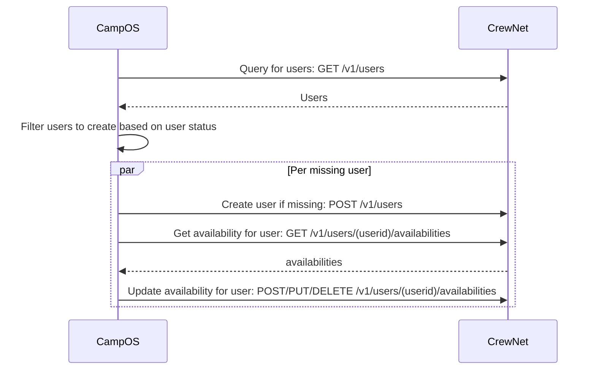
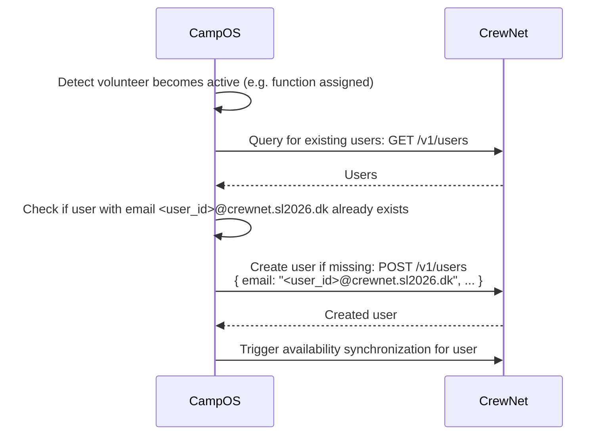
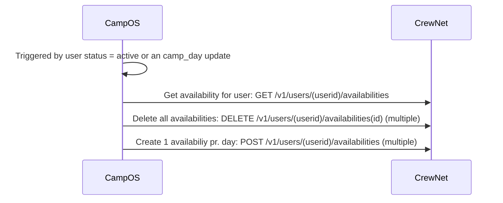
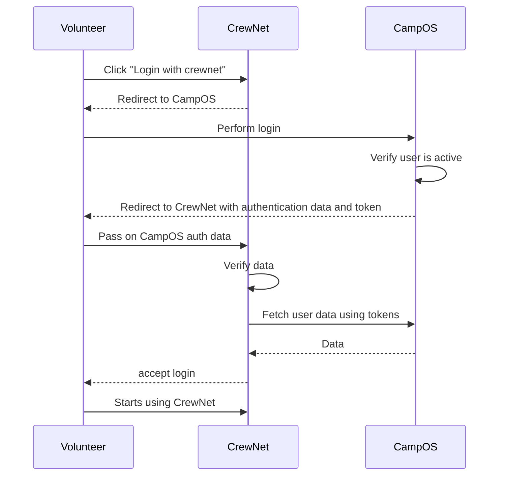
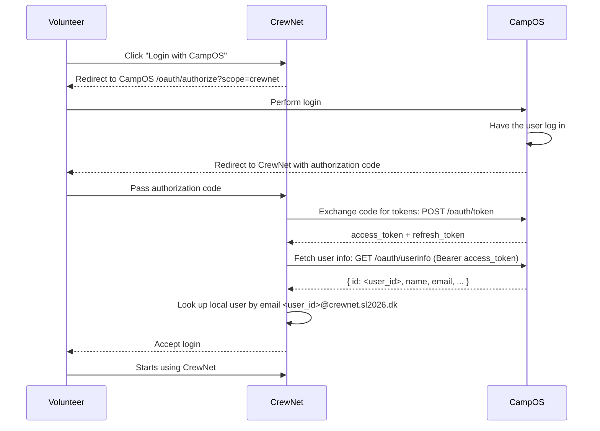
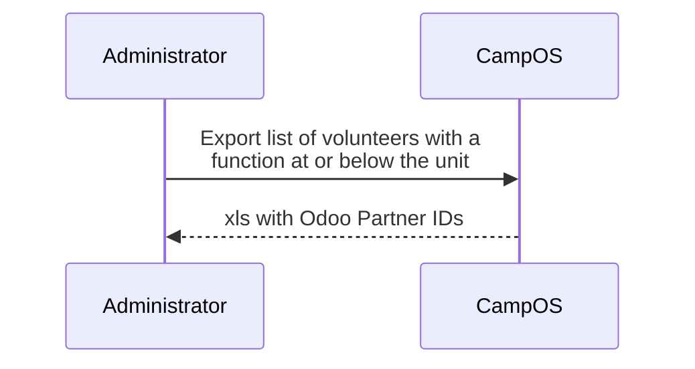
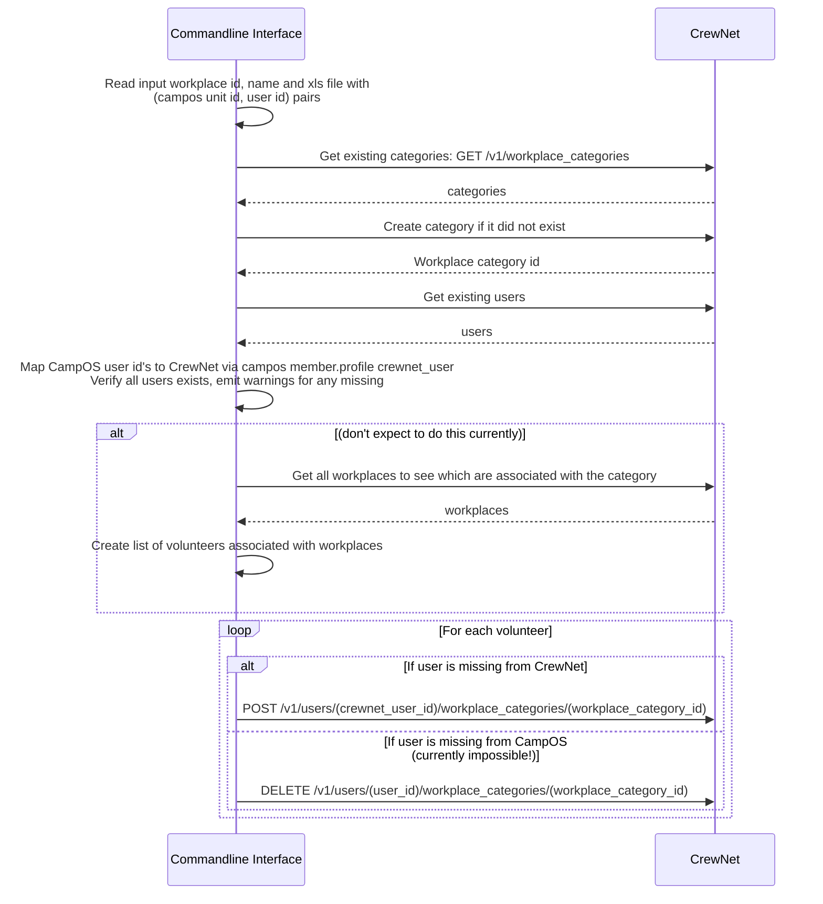
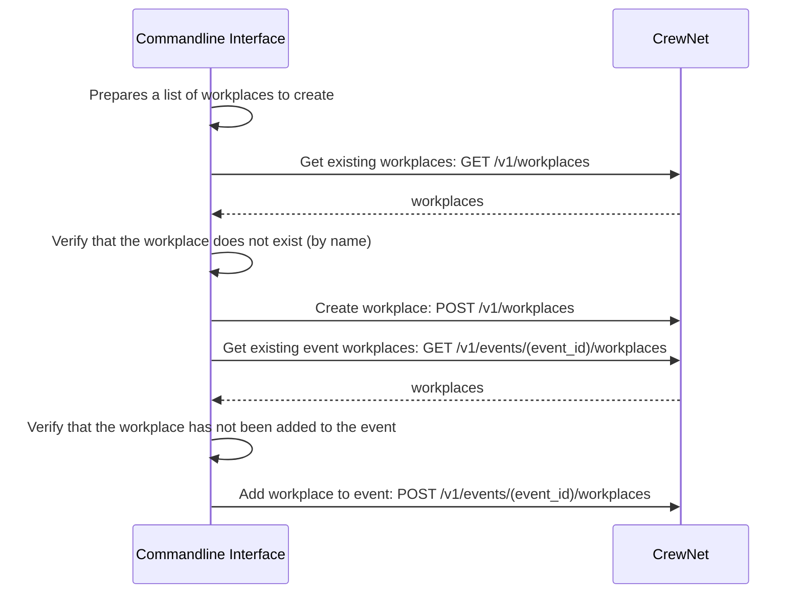
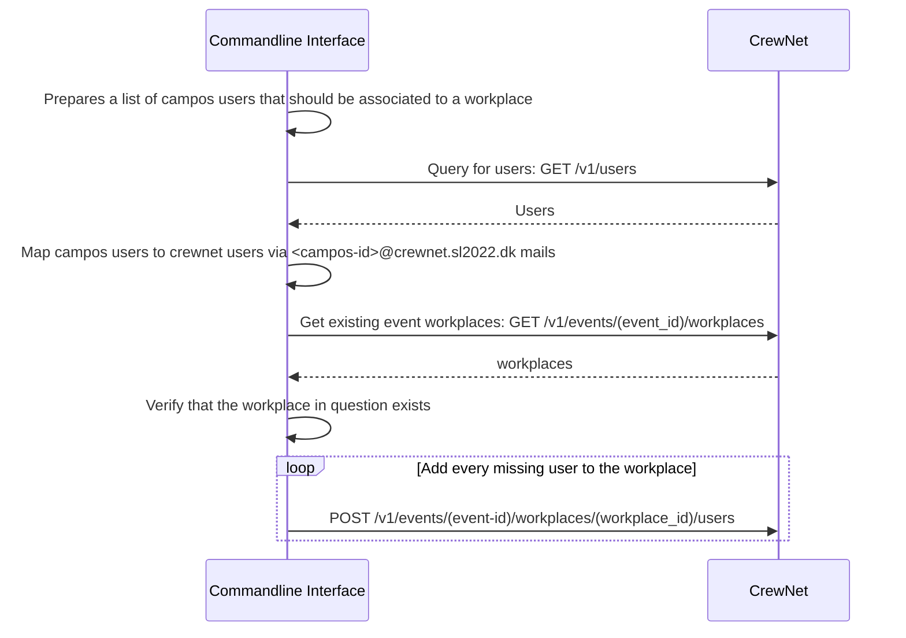
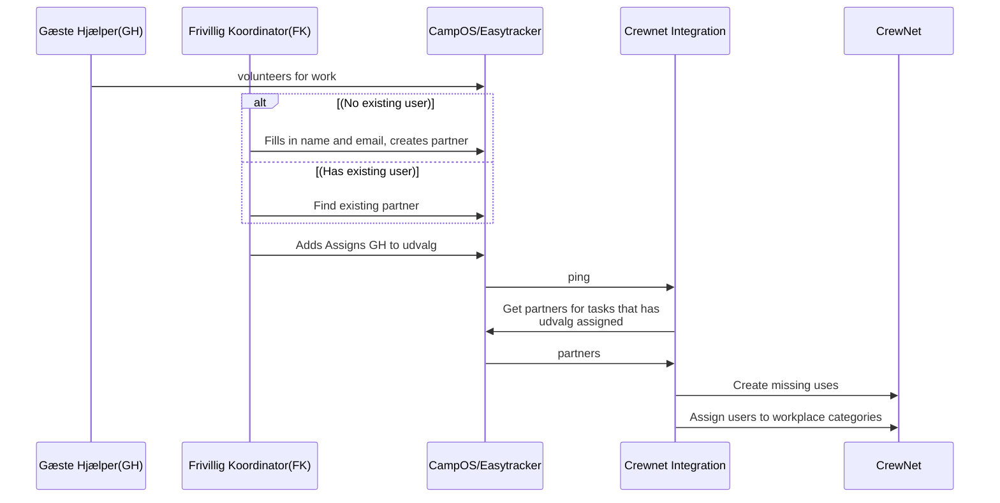

# CrewNet integration

The following document describes which parts of the CrewNet API is used by the camp, and which manual and automated processes that has been put in place to support the creation, update and synchronization of workplans.

We have the following integrations

* [User creation](#user-creation) (initial + continuous)
* [User availability synchronization](#availability-synchronization)
* [Oauth based SSO login](#single-sign-on)

Besides the automatic integration driven by CampOS, we expect to have the following flows driven by ad-hoc executions of scripts:

* [Workplace creation](#workplace-creation-manual)
* [Workplace association](#workplace-member-association)

## User creation

CampOS performs a non-updating one-way synchronization of CrewNet users. When a user reaches a state in CampOS that allows it access to Crewnet, CampOS reaches out and creates the user. We currently do not have a flow for deleting users. This flow has to complete for a user before the user can log on.

We first create all outstanding users, and from that point forward all newly created users are created.

### CrewNet API used

* GET /v1/users
* POST /v1/users

### Initial user creation


```mermaid
sequenceDiagram
    participant campos as CampOS
    participant crewnet as CrewNet

campos ->> crewnet: Query for users: GET /v1/users
crewnet -->> campos: Users
campos ->> campos: Filter users to create based on user status
par Per missing user
campos ->> crewnet: Create user if missing: POST /v1/users
campos ->> crewnet: Get availability for user: GET /v1/users/(userid)/availabilities
crewnet -->> campos: availabilities
campos ->> crewnet: Update availability for user: POST/PUT/DELETE /v1/users/(userid)/availabilities
# later

end
```

### Continuous user creation

As volunteers become active in CampOS they are created in CrewNet. The user is created with a synthetic email `<user_id>@crewnet.sl2026.dk` (where `user_id` is the CampOS user ID) that ties the account to CrewNet and is later used for user lookup during SSO (see [Single Sign-On](#single-sign-on)).


```mermaid
sequenceDiagram
    participant campos as CampOS
    participant crewnet as CrewNet

campos ->> campos: Detect volunteer becomes active (e.g. function assigned)
campos ->> crewnet: Query for existing users: GET /v1/users
crewnet -->> campos: Users
campos ->> campos: Check if user with email <user_id>@crewnet.sl2026.dk already exists
campos ->> crewnet: Create user if missing: POST /v1/users<br>{ email: "<user_id>@crewnet.sl2026.dk", ... }
crewnet -->> campos: Created user
campos ->> crewnet: Trigger availability synchronization for user

```

## Availability synchronization

CampOS continuously synchronizes users availability

### CrewNet API used

* GET /v1/users/(userid)/availabilities
* POST /v1/users/(userid)/availabilities
* DELETE /v1/users/(userid)/availabilities/(id)

### Availability flow


```mermaid
sequenceDiagram
    participant campos as CampOS
    participant crewnet as CrewNet

campos ->> campos: Triggered by user status = active or an camp_day update
campos ->> crewnet: Get availability for user: GET /v1/users/(userid)/availabilities
campos ->> crewnet: Delete all availabilities: DELETE /v1/users/(userid)/availabilities(id) (multiple)
campos ->> crewnet: Create 1 availabiliy pr. day: POST /v1/users/(userid)/availabilities (multiple)

```

## Single Sign on

CrewNet uses CampOS as an OAuth provider to authenticate users. There is no role-based authorization — all users are treated as equal (non-admins). Users must exist in CrewNet before they can log in (see [User creation](#user-creation)).

CrewNet identifies users by looking them up via their CampOS user ID mapped to a `<id>@crewnet.sl2026.dk` email address.

### APIs

* No CrewNet API endpoints are used
* CampOS OAuth endpoints: `/oauth/authorize`, `/oauth/token`, `/oauth/userinfo`

### Oauth flow (outdated — superseded below)

> **This diagram is outdated.** See the updated flow below.


```mermaid
sequenceDiagram
    participant user as Volunteer
    participant crewnet as CrewNet
    participant campos as CampOS

user ->> crewnet: Click "Login with crewnet"
crewnet -->> user: Redirect to CampOS
user ->> campos: Perform login
campos ->> campos: Verify user is active
campos -->> user: Redirect to CrewNet with authentication data and token
user ->> crewnet: Pass on CampOS auth data
crewnet ->> crewnet: Verify data
crewnet ->> campos: Fetch user data using tokens
campos -->> crewnet: Data
crewnet -->> user: accept login
user ->> crewnet: Starts using CrewNet
```

### Updated OAuth flow (current)

Key changes from the old flow:
- CrewNet requests the `crewnet` OAuth scope explicitly
- After the token exchange, CrewNet calls the `/oauth/userinfo` endpoint
- The userinfo response includes an `id` field (the CampOS user ID)
- CrewNet resolves the local user by looking up email `<id>@crewnet.sl2026.dk`


```mermaid
sequenceDiagram
    participant user as Volunteer
    participant crewnet as CrewNet
    participant campos as CampOS

user ->> crewnet: Click "Login with CampOS"
crewnet -->> user: Redirect to CampOS /oauth/authorize?scope=crewnet
user ->> campos: Perform login
campos ->> campos: Have the user log in
campos -->> user: Redirect to CrewNet with authorization code
user ->> crewnet: Pass authorization code
crewnet ->> campos: Exchange code for tokens: POST /oauth/token
campos -->> crewnet: access_token + refresh_token
crewnet ->> campos: Fetch user info: GET /oauth/userinfo (Bearer access_token)
campos -->> crewnet: { id: <user_id>, name, email, ... }
crewnet ->> crewnet: Look up local user by email <user_id>@crewnet.sl2026.dk
crewnet -->> user: Accept login
user ->> crewnet: Starts using CrewNet
```

```bash
# Step 1 — user visits this URL in their browser (redirect from CrewNet)
GET https://<campos-domain>/oauth/authorize?response_type=code&client_id=<client_id>&redirect_uri=<redirect_uri>&scope=crewnet

# Step 2 — CrewNet exchanges the authorization code for tokens
curl -X POST https://<campos-domain>/oauth/token \
  -H "Content-Type: application/x-www-form-urlencoded" \
  -d "grant_type=authorization_code" \
  -d "code=<authorization_code>" \
  -d "client_id=<client_id>" \
  -d "client_secret=<client_secret>" \
  -d "redirect_uri=<redirect_uri>"
# Response: { "access_token": "...", "refresh_token": "...", "token_type": "Bearer", ... }

# Step 3 — CrewNet fetches userinfo to resolve the local user
curl https://<campos-domain>/oauth/userinfo \
  -H "Authorization: Bearer <access_token>"
# Response: { "id": 12345, "name": "...", "email": "...", ... }
# CrewNet then looks up the user by email: 12345@crewnet.sl2026.dk
```

## Workplace category (manual)

CampOS associates volunteers to "units" that correlates well to the groups of workers we may want to associate with a workplace. To ease the administration of adding workers to workplaces we have a manual process in place of first extracting a list of users from CampOS and then synchronizing the list with a workplace category.

### CrewNet API used

* GET /v1/workplaces
* POST /v1/workplaces
* GET /v1/events/(event_id)/workplace
* POST /v1/events/(event_id)/workplaces

### Workplace category synchronization flow

#### Volunteer list extraction


```mermaid
sequenceDiagram
participant admin as Administrator
participant campos as CampOS

admin ->> campos: Export list of volunteers with a <br>function at or below the unit
campos -->> admin: xls with Odoo Partner IDs

```

Synchronize workplace category **Note - this is out of date**


```mermaid
sequenceDiagram
participant cli as Commandline Interface
participant crewnet as CrewNet

cli ->> cli: Read input workplace id, name and xls file with <br>(campos unit id, user id) pairs
cli ->> crewnet: Get existing categories: GET /v1/workplace_categories
crewnet -->> cli: categories
cli ->> crewnet: Create category if it did not exist
crewnet -->> cli: Workplace category id

cli ->> crewnet: Get existing users
crewnet -->> cli: users
cli ->> cli: Map CampOS user id's to CrewNet via campos member.profile crewnet_user<br>Verify all users exists, emit warnings for any missing
alt (don't expect to do this currently)
cli ->> crewnet: Get all workplaces to see which are associated with the category
crewnet -->> cli: workplaces
cli ->> cli: Create list of volunteers associated with workplaces
end
loop For each volunteer
    alt If user is missing from CrewNet
      cli ->> crewnet: POST /v1/users/(crewnet_user_id)/workplace_categories/(workplace_category_id)
    else If user is missing from CampOS<br>(currently impossible!)
      cli ->> crewnet: DELETE /v1/users/(user_id)/workplace_categories/(workplace_category_id)
    end
end


```

## Workplace creation (manual)

CampOS is not able to deduce which workplaces should exist in crewnet. As an alternative we may implement a simple tool that given a list of workplaces creates them automatically.

### CrewNet API used

* GET /v1/workplaces
* POST /v1/workplaces
* GET /v1/events/(event_id)/workplaces
* POST /v1/events/(event_id)/workplaces

### Workplace creation flow


```mermaid
sequenceDiagram
participant cli as Commandline Interface

participant crewnet as CrewNet

cli ->> cli: Prepares a list of workplaces to create
cli ->> crewnet: Get existing workplaces: GET /v1/workplaces
crewnet -->> cli: workplaces
cli ->> cli: Verify that the workplace does not exist (by name)
cli ->> crewnet: Create workplace: POST /v1/workplaces

cli ->> crewnet: Get existing event workplaces: GET /v1/events/(event_id)/workplaces
crewnet -->> cli: workplaces
cli ->> cli: Verify that the workplace has not been added to the event
cli ->> crewnet: Add workplace to event: POST /v1/events/(event_id)/workplaces


```

## Add workplace members (manual)

CampOS is not able to deduce which users should be a member of a given workplace. Instead we promote a number of users to administrators and let them create their workplaces and add volunteers as members. This requires a lot of clicks in the webintefaces, so reduce the amount of manual work, we may implement a commandline interface that given a list of camp volunteers that should be members of a given workplace makes this association.

### CrewNet API used

* GET /v1/users
* GET /v1/events/(event_id)/workplaces
* GET /v1/events/(event-id)/workplaces/(workplace-id)/users
* POST /v1/events/(event-id)/workplaces/(workplace_id)/users

### Workplace member association flow


```mermaid
sequenceDiagram
participant cli as Commandline Interface

participant crewnet as CrewNet

cli ->> cli: Prepares a list of campos users that should be associated to a workplace
cli ->> crewnet: Query for users: GET /v1/users
crewnet -->> cli: Users
cli ->> cli: Map campos users to crewnet users via <campos-id>@crewnet.sl2022.dk mails
cli ->> crewnet: Get existing event workplaces: GET /v1/events/(event_id)/workplaces
crewnet -->> cli: workplaces
cli ->> cli: Verify that the workplace in question exists
loop Add every missing user to the workplace
    cli ->> crewnet: POST /v1/events/(event-id)/workplaces/(workplace_id)/users
end
```

## Guest helper


```mermaid
sequenceDiagram
participant gh as Gæste Hjælper(GH)
participant fk as Frivillig Koordinator(FK)
participant campos as CampOS/Easytracker
participant cni as Crewnet Integration
participant crewnet as CrewNet

gh ->> campos: volunteers for work
alt (No existing user)
fk ->> campos: Fills in name and email, creates partner
else (Has existing user)
fk ->> campos: Find existing partner
end
fk ->> campos: Adds Assigns GH to udvalg
campos ->> cni: ping
cni ->> campos: Get partners for tasks that has<br>udvalg assigned
campos ->> cni: partners
cni ->> crewnet: Create missing uses
cni ->> crewnet: Assign users to workplace categories
```
